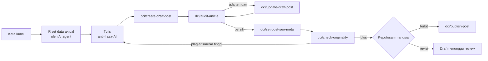

# DCI MCP Bridge

> **Professional AI bridge for WordPress** — hardens the official [MCP Adapter](https://wordpress.org/plugins/mcp-adapter/) and turns it into a full end-to-end SEO content workbench: generate, audit, optimize (Rank Math), AI-detect & plagiarism-check, then publish — all via MCP, all under human control.

**DCI MCP Bridge** adalah plugin pendamping resmi untuk [MCP Adapter](https://wordpress.org/plugins/mcp-adapter/) yang mengubah situs WordPress Anda menjadi **meja kerja konten SEO yang bisa dikerjakan AI agent** (Claude, Cursor, Z Code, dsb.) — aman, terkendali, dan profesional: AI membuat dan memperbaiki, manusia yang memutuskan terbit.

Dikembangkan oleh **Mas Wondho — [Duta Corpora Indonesia](https://dutacorpora.co.id/)**.

---

## ✨ Fitur

### 🛡️ Hardening Gerbang MCP
Gerbang HTTP MCP Adapter secara default hanya menanyakan "apakah user sudah login" — terlalu longgar untuk produksi. Plugin ini menaikkannya via **filter resmi** MCP Adapter sehingga hanya **Editor ke atas** yang bisa menyambung (bisa dipilih: `manage_options` untuk Administrator saja).

### 🧩 8 Kemampuan (Abilities) Siap MCP
Semua kemampuan terdaftar lewat **Abilities API** (WP 6.9+) dan otomatis tampil di MCP Adapter:

| Ability | Fungsi | Sifat |
|---|---|---|
| `dci/generate-text` | Generate teks via mesin **AI Puffer** yang terpasang di situs (OpenAI, Claude, Gemini, DeepSeek, dll) — panggilan internal tanpa HTTP | Baca · pakai kredit AI |
| `dci/create-draft-post` | Simpan artikel baru — **selalu menjadi draf**, tidak pernah langsung terbit | Tulis |
| `dci/update-draft-post` | Perbaiki isi draf; artikel yang sudah terbit **ditolak** | Tulis · khusus draf |
| `dci/set-post-seo-meta` | Isi field **Rank Math**: meta title/description, focus keyword, OG title/description, direktif robots | Tulis · khusus draf |
| `dci/audit-article` | **14 pemeriksaan on-page deterministik**: judul, meta, kata kunci (posisi & kepadatan), heading, tautan internal/eksternal, anchor generik, tautan duplikat, alt text, panjang konten, skor Rank Math + **pemindai frasa klise AI (EN/ID)** | Baca |
| `dci/check-originality` | **Gerbang finalisasi** via Winston AI: skor "kemiripan manusia" + kalimat yang di-flag + persentase plagiarisme & sumbernya — mendukung Bahasa Indonesia | Baca · berbiaya kredit |
| `dci/publish-post` | Menerbitkan draf sebagai **aksi eksplisit terpisah** (kapabilitas `publish_posts`) | Tulis |
| `dci/get-seo-config` | Baca konfigurasi best-practice Rank Math + status mesin AI & integritas | Baca |

### 🔑 Rotasi Multi API Key
Untuk layanan berbayar (Winston AI), plugin mendukung **beberapa kunci sekaligus**: diputar bergantian (*round-robin*), **failover otomatis** saat kunci ditolak/habis kredit/kena batas laju (401/402/429), dan **cooldown 30 menit** per kunci bermasalah. Kunci tidak pernah tampil penuh di UI maupun bocor ke AI agent.

### 🖥️ Halaman Admin "DCI Bridge"
Panel status di wp-admin: kesehatan tiga integrasi (MCP Adapter / AI Puffer / Rank Math), tabel kemampuan + status registrasinya, konfigurasi keamanan aktif, manajemen API key, dan panduan koneksi AI agent lengkap dengan endpoint.

## 🔄 Alur Kerja

> Filosofinya: **plugin adalah tangan, AI agent adalah otak.** Riset dan penulisan dilakukan agent dengan metodologi SEO & anti-slop; plugin menyediakan jalur yang aman, terukur, dan terkendali.

## 🚀 Instalasi

1. Pasang & aktifkan [MCP Adapter](https://wordpress.org/plugins/mcp-adapter/) (dependensi wajib — aktivasi otomatis ditolak bila belum ada).
2. Unggah plugin ini via `Plugins → Add New → Upload Plugin`, aktifkan.
3. Pastikan ada API key provider AI di AIPKit (AI Puffer) untuk kemampuan generate.
4. (Opsional) Untuk kemampuan integritas: daftar di [dev.gowinston.ai](https://dev.gowinston.ai) (2.000 kredit gratis), tempel API key di menu **DCI Bridge → Integritas Konten** — boleh lebih dari satu, rotasi otomatis.
5. Buka menu **DCI Bridge** — pastikan ketiga status hijau, ikuti panduan koneksi AI agent di halaman itu.

**Persyaratan**: WordPress 6.9+ · PHP 7.4+ · MCP Adapter aktif

## ⚙️ Konfigurasi (opsional, via `wp-config.php`)

| Konstanta | Default | Fungsi |
|---|---|---|
| `DCI_MCP_MIN_CAPABILITY` | `edit_posts` | Kemampuan minimum untuk masuk gerbang MCP. Set `manage_options` = hanya Administrator. |
| `DCI_WINSTON_API_KEYS` | — | Daftar API key Winston AI (pisahkan koma) — menimpa kunci yang diisi lewat halaman admin. |

## 🔐 Keamanan

- **Lapis ganda**: gerbang transport (kapabilitas) + izin per-kemampuan.
- **Draf terkunci**: semua penulisan konten berhenti di draf; penerbitan = aksi eksplisit terpisah.
- **Sanitasi konten**: `wp_kses_post` / `sanitize_text_field` di semua input; whitelist direktif robots.
- **Rahasia tetap rahasia**: API key disimpan tersembunyi (hanya 4 karakter terakhir di UI), tidak pernah dikirim ke AI agent; state rotasi hanya menyimpan hash kunci.
- **Fail-safe**: konten pendek ditolak sebelum pemeriksaan berbayar; error autentikasi/kredit dijelaskan dengan bahasa manusia.

## 🗺️ Roadmap

- [ ] Tombol ON/OFF per kemampuan di halaman admin
- [ ] Generator gambar via AI Puffer (`dci/generate-image`)
- [ ] Provider integritas alternatif (GPTZero, Copyleaks)
- [ ] Multi-bahasa untuk pemindai frasa klise

## 📄 Dokumentasi

- Panduan pemasangan operasional: [`readme.txt`](readme.txt) (format WordPress.org, Bahasa Indonesia)
- Riwayat perubahan: [`CHANGELOG.md`](CHANGELOG.md)

## 📜 Lisensi

[GPL-2.0-or-later](LICENSE) — sesuai standar plugin WordPress.

## 👤 Kredit

**Mas Wondho** — [Duta Corpora Indonesia](https://dutacorpora.co.id/)
Dibangun di atas [MCP Adapter](https://wordpress.org/plugins/mcp-adapter/) resmi WordPress, [Abilities API](https://developer.wordpress.org/apis/abilities-api/) (WP 6.9), AI Puffer, Rank Math, dan Winston AI.
